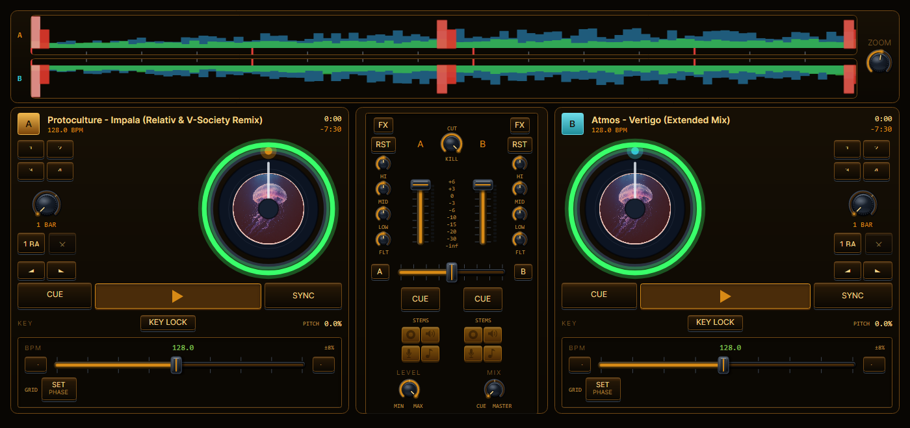
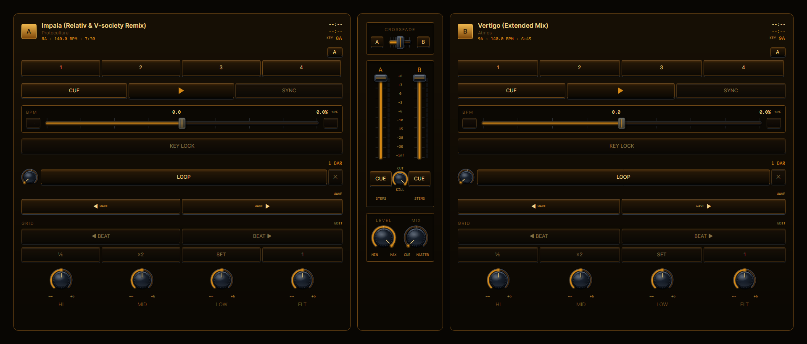
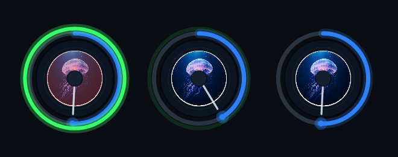
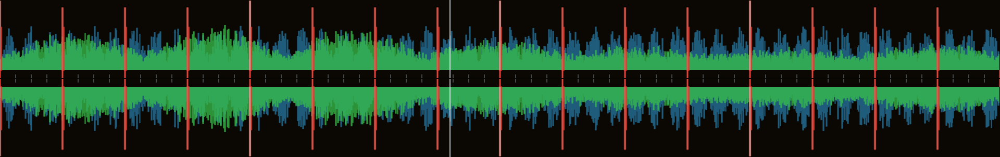
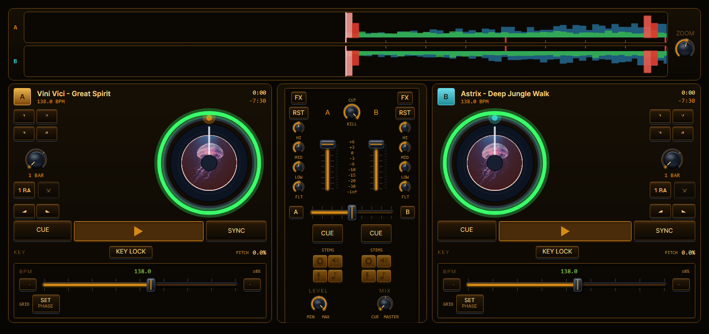

<p align="center">
  
</p>

<h1 align="center">Liveolator</h1>

<p align="center">
  <strong>Play, mix, and <em>see</em> your music.</strong><br>
  A cross-platform DJ&nbsp;+&nbsp;VJ performance app where the decks and the visuals run off <em>one shared beat clock</em>.
</p>

<p align="center">
  <a href="LICENSE"></a>
  
  
  <a href=".github/workflows/ci.yml"></a>
  <a href="CONTRIBUTING.md"></a>
</p>

<p align="center">
  <a href="https://github.com/zalmanimrecords-stack/DJliveolator/releases/latest"></a>
  &nbsp;&nbsp;<a href="https://liveolator.zalmanim.com"><strong>liveolator.zalmanim.com</strong></a>
</p>

---

Liveolator is a **DJ + VJ performance instrument**: two decks with a real software
mixer, beat detection and one-button SYNC, a production-grade music library, *and* a
GPU visual engine that reacts to the music in real time — driven from an Ableton
Push 1, a Behringer CMD STUDIO 2A, or any class-compliant MIDI controller.

What makes it different: **audio and visuals share a single beat clock.** A
beat-matched mix and a beat-synced visual are the *same* timeline, not two systems
trying to chase each other. That one decision is the whole point of the project.

> Liveolator is the cross-platform successor to the Windows-only Zalmanolator. It
> keeps the platform-agnostic architecture designed for Zalmanolator's "Live Mode"
> and drops the Windows-locked stack (WPF, C++/CLI, NAudio) and projectM/MilkDrop.
> It runs on Windows today; macOS is the design target and the reason the project
> exists.

## See it

|  |  |
|---|---|
|  |  |
| **Two decks + a real software mixer** — crossfader, per-channel EQ/filter, hot cues, loops, key & BPM. | **The audio↔visual link** — the jog wheels are drawn by the same GPU engine that drives the show, reacting per deck. |
|  |  |
| **A kick-forward waveform** — 3-band split (lows/mids/highs) with a beat grid, so you *see* the kick, not just a blob. | **Density when you want it** — the DJ tab folds everything onto one no-scroll screen. |

## What it does

- **DJ engine** — two decks, software mixer (crossfader, per-channel EQ/filter),
  beat detection, one-button SYNC with continuous phase-lock, low-latency audio,
  and a headphone cue bus.
- **VJ engine** — GPU-shader manipulation of **images, video clips, and live
  camera/capture input**, composited in layers and synced to the beat
  (Resolume-style). **No MilkDrop/projectM.**
- **Music library** — fast filesystem scan, offline analysis (BPM, key, structure,
  hot cues), harmonic (Camelot) matching, and an SQLite/JSON catalog. Import from
  Rekordbox, Traktor, Serato, VirtualDJ, Mixxx, and Engine DJ.
- **Hardware control** — Ableton Push 1 (visuals) + Behringer CMD STUDIO 2A (DJ
  transport + its built-in 4-channel interface), or **any class-compliant MIDI
  controller** — MIDI-learn maps any control to any action.
- **One action layer** — hardware, UI, and automation all emit the same
  serializable `PerformanceAction`s; engines are driven only through a dispatcher,
  so a controller, a mouse click, and an automation script are interchangeable.

## Why it's built this way

- **One shared beat clock** drives both the mix and the visuals — the differentiator.
- **Seam architecture:** every input (hardware/UI/automation) emits the same
  `PerformanceAction`; engines never call each other directly. Easy to test, easy
  to remap, easy to script.
- **`Liveolator.Core` is pure C#** — no UI, no native code — so the beat engine,
  mixing math, mapping, and playlist logic unit-test under xUnit **without
  hardware**. There are **~1,000+ passing tests**.

## Platform & stack

| Concern | Choice |
|---------|--------|
| Runtime / UI | .NET 8 + **Avalonia** (cross-platform XAML/MVVM) |
| Graphics / effects | **OpenGL via Silk.NET** + **SkiaSharp** (GLSL fragment shaders on textures) |
| Video / camera decode | **FFmpeg** CLI (frame → GL texture; dshow on Windows, avfoundation on macOS) |
| Audio (DJ) | **BASS / ManagedBass** — used under un4seen's free license (free while Liveolator is; see [`LICENSE`](LICENSE) / [`THIRD-PARTY-NOTICES.txt`](THIRD-PARTY-NOTICES.txt)) |
| MIDI | **RtMidi.Core** (cross-platform) |

ASIO (Windows) and CoreAudio (macOS) are reached through the audio library; the app
code only sees the platform-agnostic seam interfaces.

## Getting started

**Just want to run it?** Grab the [latest Windows installer](https://github.com/zalmanimrecords-stack/DJliveolator/releases/latest)
(self-contained — no .NET install needed), or download it from
[liveolator.zalmanim.com](https://liveolator.zalmanim.com). macOS is in progress.

**Building from source:**

```sh
# 1. Fetch the BASS native libraries from un4seen (not bundled — see LICENSE).
pwsh scripts/fetch-bass.ps1        # Windows / PowerShell
./scripts/fetch-bass.sh            # macOS / Linux

# 2. Build and run.
dotnet build Liveolator.sln -c Release
pwsh scripts/run.ps1               # or:  ./scripts/run.sh

# 3. Run the tests (no hardware needed).
dotnet test Liveolator.sln
```

FFmpeg is optional and invoked as a separate process; put `ffmpeg` on your `PATH`
(or set `LIVEOLATOR_FFMPEG_PATH`) to enable video/camera decode.

## Repository layout

```text
Liveolator/
  docs/            # architecture & design
  src/
    Liveolator.Core/      # platform-agnostic: seams, beat engine, actions, mapping,
                          # playlist, autopilot, visual scene model  (no UI, no native)
    Liveolator.App/       # Avalonia UI
    Liveolator.Audio/     # audio I/O binding (BASS/ManagedBass) + offline decode
    Liveolator.Media/     # filesystem enumerator + catalog cache (JSON / SQLite)
    Liveolator.Midi/      # RtMidi binding
    Liveolator.Visuals/   # Silk.NET/OpenGL compositor + GLSL effects + FFmpeg decode
    Liveolator.Mcp/       # MCP server: music-intelligence tools for external AI agents
    Liveolator.Online/    # optional online metadata enrichment
    Liveolator.Platform/  # platform integration helpers
  tests/           # xUnit tests (Core is pure logic; runs without hardware)
```

## Status

Working integrated app, not a design sketch: a two-deck DJ engine, one-button SYNC
with continuous phase-lock, a production-grade music library + analysis, and a GL
layer compositor with beat-reactive generators — all driven through one
`PerformanceAction` dispatcher and covered by ~1,000+ passing tests. The
audio↔visual link runs off one shared beat clock.

For the current state, verified bug map, and prioritized next steps see
[`docs/27-system-review-2026-06-10.md`](docs/27-system-review-2026-06-10.md) and
[`docs/22-status-and-roadmap.md`](docs/22-status-and-roadmap.md);
[`docs/00-LIVEOLATOR-CONTEXT.md`](docs/00-LIVEOLATOR-CONTEXT.md) holds the direction
and what carries over from Zalmanolator. **Still open** (good places to help):
keylock, the VJ authoring UI, and cross-platform (macOS) packaging.

## Contributing

Contributions, bug reports, and ideas are welcome — see
[`CONTRIBUTING.md`](CONTRIBUTING.md) for how the project works and the best ways to
help. New here? Look for issues labelled
[`good first issue`](https://github.com/zalmanimrecords-stack/DJliveolator/labels/good%20first%20issue).
For anything non-trivial, please open an issue to discuss it **before** writing a
large PR. Everyone is expected to follow the
[Code of Conduct](CODE_OF_CONDUCT.md).

## License

Liveolator is free software, licensed under the **GNU General Public License,
version 3 or later (GPLv3+)** — see [`LICENSE`](LICENSE). It is and always will be
free of charge.

**Important — the BASS audio library is not GPL and not included here.** The native
BASS libraries (un4seen Developments Ltd.) are a separate, proprietary dependency
that this repository does *not* contain. They are fetched from un4seen at build time
(`scripts/fetch-bass.*`) and are used under un4seen's own license. BASS is free only
while the product using it is also free of charge and generates no revenue; anyone
who sells or otherwise monetizes Liveolator or a derivative must obtain their own
BASS license from <https://www.un4seen.com/>. To keep this arrangement lawful under
the GPL, an additional permission (GPLv3 §7) allowing Liveolator to be combined with
BASS is granted in [`LICENSE-EXCEPTION.txt`](LICENSE-EXCEPTION.txt).

All bundled third-party components and their licenses are listed in
[`THIRD-PARTY-NOTICES.txt`](THIRD-PARTY-NOTICES.txt).
